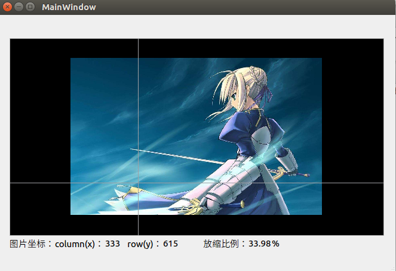

# QTcreator：图像-GUI交互组件

## 简要说明

- 这是大约在2018年11月的东西，当时我接触的界面程序开发工具是**QTcreator**（2018.9-2019.4）。
- 我在进行一个制作一个用于目标检测-图像数据标注的助手。当时是参考着知名的**labelme**项目的，因为当时不会**PyQt**，或者说对python开发还不熟悉（仅仅用于学习mxnet和写简单的训练脚本），或者是因为python-IDE真的对我不够友好（瞧咱的QTcreator那新建、调试、查看查找的功能:smile:）。
- 这只是一个基于GraphView开发的图像操作交互组件，而不是标注工具！但在稍后的时间（我是说作为中华码农，我挺被勤劳的:smile:），我会补上这一块项目，届时会在README.MD文件中声明本组件。
- 本组件当时的一些详细资料已经缺失，有一种不想重新写的感觉:smirk:。但我会尽量做一些说明，或者大家自行探索（这东西开源撒～那还要什么解释:smirk:）。
- 现在已经过去一年了。新的一年我的主要开发语言是python，前阵子终于有时间去了解PyQt的项目，很感谢github这个最大的同性交友平台:smirk:。再回头看时，发现QTcreator新版本也支持python程序开发！（想试试）

### 许可证

开源免费： [MIT license](https://github.com/tzutalin/labelImg/blob/master/LICENSE)

### 此项目与组件介绍

#### 1、项目的文件系统

此项目主要是一个“库工程”（imageGUI），但因调试、展示等原因嵌入在一个应用程序中（imageGUI_demo）。可以使imageGUI_demo工程工作在两种模式（开发库or使用库），但其实我已经不怎么打算更新它，之所以建立这个demo，主要是写组件介绍时希望能补充一点效果图。当然，后续可能会增加更详细的说明。

#### 2、组件效果：可以当做一个图像查看器

最简单的使用莫过于仅仅查看图像，组件支持互动（鼠标键盘）调整基本的查看效果，如放缩图像尺寸、移动图像，如图所示例。

